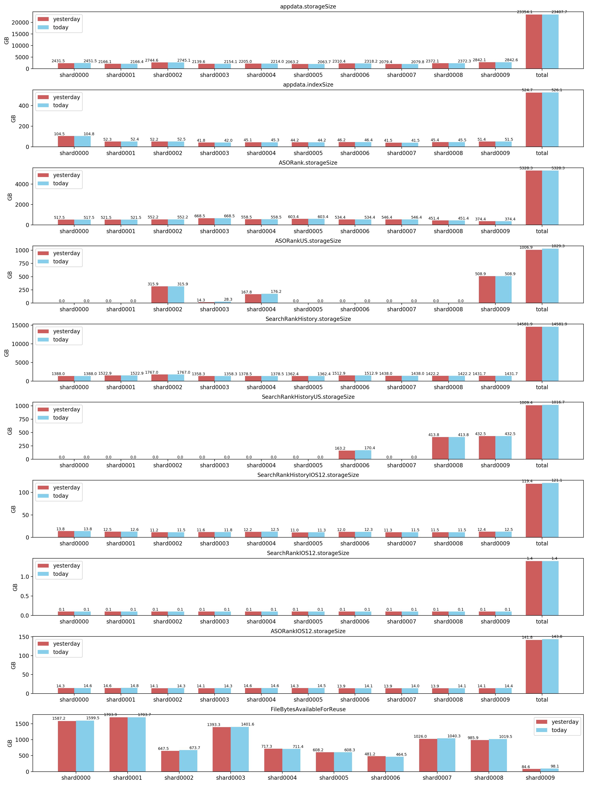

### mongo data distribution
分析MongoDB集群中collections数据大小分布图, collection大小统计的是storageSize
+ 示例图


#### 使用方法
+ 环境
  - Python3.5+
  - MacOS
  - CentOS7+
  - MongoDB 3.4+ Cluster
  - 其他系统未测试

+ 安装
```
git clone git@github.com:vegaoqiang/mongo-data-distribution.git
pip install requirements
```
+ 配置
  - 根据自己的实际环境, 修改mongodata-distribution.py对应信息

+ 运行
  - python3 mongodata-distribution.py
  - 生成的图片会保存在/tmp/stats.temp目录下

#### TODO
分离配置信息, 简化安装步骤

